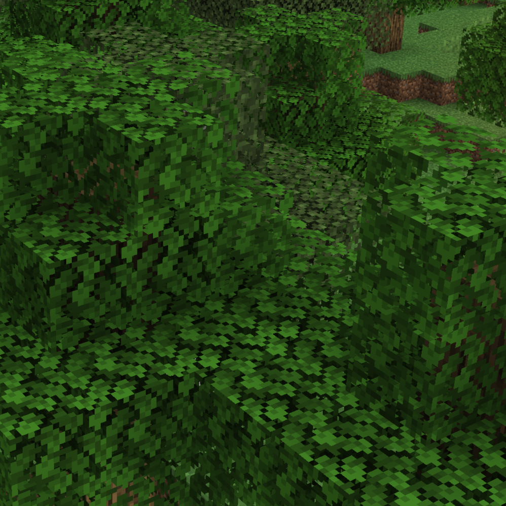

# Dainty

A Minecraft mod that adds in a bunch of small quality of life changes. Some are from other mods, some are original.

## Features

|Image | Description | Configuration |
|------|-------------|---------------|
|  | 
 **No Farmland Trampling**   Removes farmland trampling entirely from all entities (players, animals, mobs, etc.). Farmland can be converted back into dirt by breaking and replacing it. 
 | `disableFarmlandTrampling: boolean = true` |
|  | 
 **Jump On Fences**   Allows players to jump onto fences. Mobs cannot jump onto fences. Non-fence jump height is unchanged; i.e., Players still cannot jump onto blocks with slabs on top. 
 | `allowJumpingOnFences: boolean = true` |
|  | 
 **Right-Click Crop Harvest**   Allows crops to be harvested and replanted by right-clicking on a mature crop. 
 | `allowRightClickHarvesting: boolean = true` |
|  | 
 **Remove Phantoms**   Disables phantom spawning. Phantom membrane is added as a (configurable) 50% drop from endermen, is retextured to be fitting for an enderman, and is renamed to "Ender Membrane". Phantom's can still be spawned with commands or spawn eggs; They just won't spawn naturally. 
 | `disablePhantoms: boolean = true`   `endermanPhantomMembraneDropChance: float = 0.5` |
|  | 
 **Carry On**   Allows picking up animals and block entities (chests, barrels, etc.) by holding a keybinding (left shift by default) and right-clicking them. The NBT data (chest contents, animal properties, etc.) will be retained after moving them. 
 | `allowPickingUpAnimals: boolean = true`   `allowPickingUpBlockEntities: boolean = true` |
|  | 
 **Linear XP**   Linearizes experience gain. For example, spending 3 levels at level 1000 is the same as spending 3 levels at level 6. 
 | `linearizeExperience: boolean = true` |
|  | 
 **Unblocked Chests**   Allows opening chests that have a solid block on top of them, as well as chests that have a cat sitting on them. 
 | `allowOpeningBlockedChests: boolean = true` |
|  | 
 **Bag Item**   Adds in a "bag" item that can hold mass quantities of a small number of different items. Items collected will automatically go into the bag if that item type is stored, including when the player's inventory is full. Higher tiers can be made to store more items and item types. 
 | `bagItem: boolean = true` |
|  | 
 **Reliable Wither skulls**   Forces killed wither skeletons to drop wither skeleton skulls every 20 (configurable) kills. Kills are tracked separately per-player; Does not affect non-player kills. 
 | `witherSkeletonKillsPerGuaranteedSkull: float = 20` |
|  | 
 **Reinforcer item**   Adds a late-game item that can be used in an anvil with any other item to make it unbreakable and unburnable. 
 | `reinforcerItem: boolean = true` |
|  | 
 **Warden Heart**   Adds a boss drop from Wardens that can be used to craft various strong or later-game items. 
 | `wardenHeartDropChance: float = 1` |
|  | 
 **Resource Fixes**   Fixes and improves a number of vanilla textures and resources in small ways. 
 |  |
|  | 
 **Biome Compass**   Adds a compass that can search for specific biomes. 
 | `enableBiomeCompassItem: boolean = true`  |
|  | 
 **Potion of the Deep Dark**   Adds a potion brewable from a Warden Heart that gives "Silent Sight", an effect making you immune to Darkness and making your footsteps silent. 
 | `enablePotionOfTheDeepDark: boolean = true`  |
|  | 
 **Fast Leaf Decay**   Makes leaves decay significantly faster. 
 | `enableFastLeafDecay: boolean = true`  |

## Credits

- Entity/BlockEntity carrying functionality provided by [CarryOn](https://github.com/Tschipp/CarryOn/tree/1.21) under [LGPL-3.0](https://www.gnu.org/licenses/lgpl-3.0.en.html)
- Warden heart texture provided by [Deeper and Darker](https://github.com/KyaniteMods/DeeperAndDarker/tree/neoforge-1.21) under [AGPL-3.0](https://www.gnu.org/licenses/agpl-3.0.en.html)
- Texture changes provided by [Vanilla Tweaks](https://vanillatweaks.net/) under [their custom license](https://vanillatweaks.net/terms/)
- Fence jumping functionality provided by [Jump Over Fences](https://gitlab.com/kreezxil/jump-over-fences/) under [their custom license](https://gitlab.com/kreezxil/jump-over-fences/-/blob/1.16.4/README.md?ref_type=heads&plain=1#L13)
- Right-click crop harvest functionality provided by [Right Click Harvest](https://github.com/JamCoreModding/right-click-harvest/tree/main?tab=MIT-1-ov-file) under [MIT](https://opensource.org/license/mit)
- Biome compass texture and functionality provided by [Nature's Compass](https://github.com/MattCzyr/NaturesCompass/tree/neoforge-1.21.1) under [Attribution-NonCommercial-ShareAlike 4.0 International](https://creativecommons.org/licenses/by-nc-sa/4.0/deed.en)